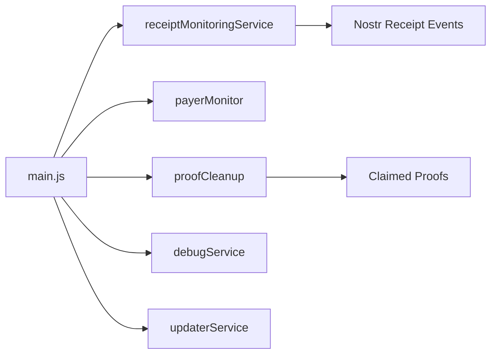
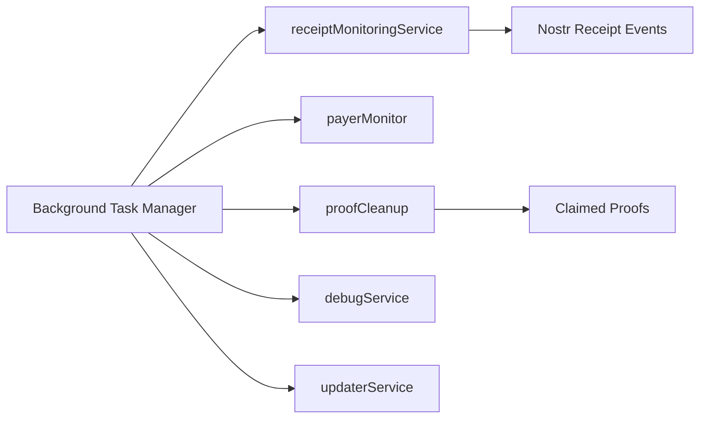

# Background Processing Architecture
## Overview
The Receipt.Cash application utilizes a robust background processing architecture to handle various tasks independently of the user interface. This document provides an analysis of the current architecture, recommends improvements, and outlines guidelines for implementing new background tasks.

## Current Architecture Analysis
The application currently employs several background services:
1. receiptMonitoringService
2. payerMonitor
3. proofCleanup
4. debugService
5. updaterService

These services are initialized in `main.js` independently of the UI, allowing for event-driven architecture with Nostr subscriptions.

### Current Background Service Architecture


## Recommended Background Task Manager Architecture
To improve the current architecture, we recommend implementing a Background Task Manager that oversees and coordinates all background services.



## Service Communication Patterns
Services should maintain their independence, with composables deriving state from them.

```mermaid
graph LR
    A[Background Services] -->|state|> B[Composables]
    B -->|derived state|> C[UI Components]
```

## Running Background Services Independently
To run a background service independently:
1. Initialize the service in `main.js`.
2. Ensure the service does not depend on UI components or lifecycle.
3. Use Nostr subscriptions or other event-driven mechanisms to trigger service actions.
4. Implement periodic tasks using `setInterval` or similar mechanisms.

Example of initializing a background service in `main.js`:
```javascript
import receiptMonitoringService from './services/receiptMonitoringService';

receiptMonitoringService.initialize();
```

## Implementation Guidelines
1. Follow the established event-driven architecture.
2. Use Nostr subscriptions for real-time event handling.
3. Implement periodic tasks using `setInterval` or similar mechanisms.
4. Keep background services independent of UI components.

By following these guidelines and the recommended architecture, we can maintain a scalable and efficient background processing system for the Receipt.Cash application.