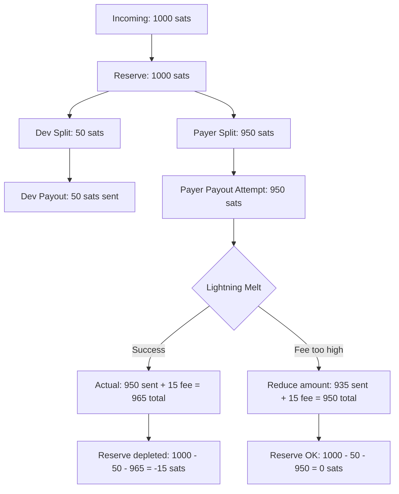

# Coco Integration Architecture Plan

## Executive Summary

This document outlines the plan to integrate the `coco-cashu` library into Receipt.Cash, replacing manual proof management with a deterministic, seedphrase-based wallet system.

**Key Goals:**
- ✅ 12-word BIP39 seedphrase for deterministic key derivation
- ✅ One balance per mint managed by coco
- ✅ Accounting per receipt/settlement/payout via local storage + Nostr events
- ✅ Handle unpredictable Lightning fees without breaking accounting
- ✅ Change jar for dust/remainingReserve (spendable for AI queries)
- ✅ Proof safety buffer to prevent loss during send operations
- ✅ Gradual TypeScript migration (new files only, no strict checking)

---

## Accounting Flow & Fee Handling

### The Problem: Unpredictable Lightning Fees

When melting to Lightning, the actual fee is unknown until the melt completes. This creates an accounting challenge:

```
Incoming: 1000 sats
Dev Split (5%): 50 sats
Payer Split (95%): 950 sats

But when melting 950 sats to Lightning:
- Actual sent: 950 sats
- Lightning fee: 15 sats (unknown beforehand!)
- Total deducted from balance: 965 sats

Problem: We only received 1000 sats, but need to send 1015 sats total!
```

### Solution: Reserve-Based Accounting

We solve this by treating the **incoming amount as the source of truth** and tracking what happens to it:



### Accounting Model

#### 1. Settlement Reserve
Each settlement creates a "reserve" equal to the incoming amount:

```typescript
interface SettlementReserve {
  receiptEventId: string;
  settlementEventId: string;
  totalIncoming: number;        // e.g., 1000 sats
  devSplitAmount: number;        // e.g., 50 sats (5%)
  payerSplitAmount: number;      // e.g., 950 sats (95%)
  devPaidOut: number;            // e.g., 50 sats (after payout)
  payerPaidOut: number;          // e.g., 935 sats (after melt with fees)
  totalFees: number;             // e.g., 15 sats (Lightning fee)
  remainingReserve: number;      // totalIncoming - devPaidOut - payerPaidOut - totalFees
  status: 'pending' | 'partial' | 'complete' | 'overspent';
}
```

#### 2. Payout Flow with Fee Handling

```typescript
// Step 1: Receive payment into coco
await coco.wallet.receive(token); // 1000 sats added to balance

// Step 2: Create settlement reserve
const reserve = {
  totalIncoming: 1000,
  devSplitAmount: 50,    // 5%
  payerSplitAmount: 950, // 95%
  devPaidOut: 0,
  payerPaidOut: 0,
  totalFees: 0,
  remainingReserve: 1000,
  status: 'pending'
};

// Step 3: Pay dev (simple, no fees)
const devToken = await coco.wallet.send(mintUrl, 50);
await sendToDev(devToken);
reserve.devPaidOut = 50;
reserve.remainingReserve = 950; // 1000 - 50

// Step 4: Pay payer with fee protection
const maxAvailable = reserve.remainingReserve; // 950 sats

if (paymentType === 'lightning') {
  // Create melt quote to check fee
  const quote = await coco.quotes.createMeltQuote(mintUrl, lightningInvoice);
  const estimatedFee = quote.fee_reserve;
  
  // Calculate safe amount to send
  const safeAmount = Math.min(
    reserve.payerSplitAmount,
    maxAvailable - estimatedFee
  );
  
  if (safeAmount <= 0) {
    throw new Error('Insufficient reserve for Lightning fees');
  }
  
  // Send safe amount
  const payerToken = await coco.wallet.send(mintUrl, safeAmount);
  const meltResult = await coco.quotes.payMeltQuote(mintUrl, quote.quote);
  
  // Record actual amounts
  reserve.payerPaidOut = safeAmount;
  reserve.totalFees = meltResult.fee;
  reserve.remainingReserve = maxAvailable - safeAmount - meltResult.fee;
  
} else if (paymentType === 'cashu') {
  // Cashu has no fees, send full amount
  const payerToken = await coco.wallet.send(mintUrl, reserve.payerSplitAmount);
  await sendToPayer(payerToken);
  reserve.payerPaidOut = reserve.payerSplitAmount;
  reserve.remainingReserve = 0;
}

// Step 5: Update status
if (reserve.remainingReserve < 0) {
  reserve.status = 'overspent'; // Should never happen with our logic
} else if (reserve.remainingReserve === 0) {
  reserve.status = 'complete';
} else {
  reserve.status = 'partial'; // Some sats left (dust or fee savings)
}
```

#### 3. Accounting Records

We track each step separately:

```typescript
// Record 1: Incoming payment
{
  type: 'incoming',
  receiptEventId: 'abc123',
  settlementEventId: 'def456',
  amount: 1000,
  mintUrl: 'https://mint.example.com',
  timestamp: 1234567890
}

// Record 2: Dev split calculation
{
  type: 'dev_split',
  receiptEventId: 'abc123',
  settlementEventId: 'def456',
  amount: 50,
  percentage: 5,
  mintUrl: 'https://mint.example.com',
  timestamp: 1234567891
}

// Record 3: Payer split calculation
{
  type: 'payer_split',
  receiptEventId: 'abc123',
  settlementEventId: 'def456',
  amount: 950,
  percentage: 95,
  mintUrl: 'https://mint.example.com',
  timestamp: 1234567892
}

// Record 4: Dev payout (actual send)
{
  type: 'dev_payout',
  receiptEventId: 'abc123',
  settlementEventId: 'def456',
  amount: 50,
  fees: 0,
  mintUrl: 'https://mint.example.com',
  timestamp: 1234567893
}

// Record 5: Payer payout (actual send with fees)
{
  type: 'payer_payout',
  receiptEventId: 'abc123',
  settlementEventId: 'def456',
  amount: 935,           // Reduced from 950 to account for fees
  fees: 15,              // Actual Lightning fee
  originalAmount: 950,   // What we wanted to send
  mintUrl: 'https://mint.example.com',
  timestamp: 1234567894
}
```

#### 4. Balance Reconciliation

At any time, we can verify:

```typescript
function verifySettlement(reserve: SettlementReserve): boolean {
  const totalOut = reserve.devPaidOut + reserve.payerPaidOut + reserve.totalFees;
  const expected = reserve.totalIncoming;
  
  // Should always be: totalOut <= totalIncoming
  return totalOut <= expected;
}
```

### Key Principles

1. **Never overspend**: Always check available reserve before sending
2. **Fees come from reserve**: Lightning fees reduce the payer's payout, not the balance
3. **Track everything**: Every sat movement is recorded
4. **Graceful degradation**: If fees are too high, send less to payer (they still get most of it)
5. **Dust handling**: Small remainders (< 10 sats) stay in balance as "fee buffer"

---

## Architecture Overview

### Current vs New Flow

**Current (Manual Proof Management):**
```
Payment → moneyStorageManager.incoming
         → wallet.send() splits proofs
         → moneyStorageManager.dev + moneyStorageManager.payer
         → Manual payout from each bucket
```

**New (Coco + Accounting):**
```
Payment → coco.wallet.receive() (unified balance)
         → accountingService.recordIncoming()
         → Calculate splits (accounting only)
         → Send from unified balance with fee protection
         → accountingService.recordPayout()
```

---

## Component Design

### 1. Seedphrase Service (TypeScript)

**File:** `src/services/seedphraseService.ts`

```typescript
import { generateMnemonic, mnemonicToSeedSync, validateMnemonic } from '@scure/bip39';
import { wordlist } from '@scure/bip39/wordlists/english';

const STORAGE_KEY = 'receipt-cash-seedphrase';

export class SeedphraseService {
  /**
   * Generate a new 12-word BIP39 seedphrase
   */
  generateSeedphrase(): string {
    return generateMnemonic(wordlist, 128); // 128 bits = 12 words
  }

  /**
   * Store seedphrase in localStorage (unencrypted per user request)
   */
  storeSeedphrase(mnemonic: string): void {
    if (!this.validateSeedphrase(mnemonic)) {
      throw new Error('Invalid seedphrase');
    }
    localStorage.setItem(STORAGE_KEY, mnemonic);
  }

  /**
   * Retrieve seedphrase from localStorage
   */
  getSeedphrase(): string | null {
    return localStorage.getItem(STORAGE_KEY);
  }

  /**
   * Convert mnemonic to 64-byte seed for coco
   */
  mnemonicToSeed(mnemonic: string): Uint8Array {
    if (!this.validateSeedphrase(mnemonic)) {
      throw new Error('Invalid seedphrase');
    }
    return mnemonicToSeedSync(mnemonic, ''); // No passphrase
  }

  /**
   * Validate a seedphrase
   */
  validateSeedphrase(mnemonic: string): boolean {
    return validateMnemonic(mnemonic, wordlist);
  }

  /**
   * Check if seedphrase exists
   */
  hasSeedphrase(): boolean {
    return this.getSeedphrase() !== null;
  }

  /**
   * Delete seedphrase (for testing/reset)
   */
  clearSeedphrase(): void {
    localStorage.removeItem(STORAGE_KEY);
  }
}

// Export singleton
export const seedphraseService = new SeedphraseService();
```

---

### 2. Coco Service (TypeScript)

**File:** `src/services/cocoService.ts`

```typescript
import { initializeCoco, Manager } from 'coco-cashu-core';
import { IndexedDbRepositories } from 'coco-cashu-indexeddb';
import { seedphraseService } from './seedphraseService';

export class CocoService {
  private coco: Manager | null = null;
  private isInitialized = false;

  async initialize(): Promise<Manager> {
    if (this.isInitialized && this.coco) {
      return this.coco;
    }

    // Get or generate seedphrase
    let mnemonic = seedphraseService.getSeedphrase();
    if (!mnemonic) {
      console.log('🔑 Generating new seedphrase...');
      mnemonic = seedphraseService.generateSeedphrase();
      seedphraseService.storeSeedphrase(mnemonic);
      console.log('✅ Seedphrase generated and stored');
    }

    // Create seed getter for coco
    const seedGetter = async (): Promise<Uint8Array> => {
      const mnemonic = seedphraseService.getSeedphrase();
      if (!mnemonic) {
        throw new Error('No seedphrase found');
      }
      return seedphraseService.mnemonicToSeed(mnemonic);
    };

    // Initialize IndexedDB repositories
    const repo = new IndexedDbRepositories({ 
      name: 'receipt-cash-coco',
      version: 1
    });

    // Initialize coco with all watchers enabled
    this.coco = await initializeCoco({
      repo,
      seedGetter,
      watchers: {
        mintQuoteWatcher: { watchExistingPendingOnStart: true },
        proofStateWatcher: {}
      },
      processors: {
        mintQuoteProcessor: {}
      }
    });

    this.isInitialized = true;

    // Subscribe to coco events for logging
    this.coco.on('receive:created', (payload) => {
      console.log('💰 Coco received:', payload);
    });

    this.coco.on('send:created', (payload) => {
      console.log('📤 Coco sent:', payload);
    });

    console.log('✅ Coco initialized');
    return this.coco;
  }

  getCoco(): Manager {
    if (!this.isInitialized || !this.coco) {
      throw new Error('Coco not initialized. Call initialize() first.');
    }
    return this.coco;
  }

  async getBalance(mintUrl: string): Promise<number> {
    const balances = await this.coco!.wallet.getBalances();
    return balances[mintUrl] || 0;
  }

  async getAllBalances(): Promise<Record<string, number>> {
    return await this.coco!.wallet.getBalances();
  }

  async dispose(): Promise<void> {
    if (this.coco) {
      await this.coco.dispose();
      this.isInitialized = false;
      this.coco = null;
    }
  }
}

// Export singleton
export const cocoService = new CocoService();
```

---

### 3. Accounting Service (TypeScript)

**File:** `src/services/accountingService.ts`

```typescript
import { ReactiveMapStorageManager } from './new/storage/reactiveMapStorageManager';

export type AccountingRecordType = 
  | 'incoming' 
  | 'dev_split' 
  | 'payer_split' 
  | 'dev_payout' 
  | 'payer_payout';

export interface AccountingRecord {
  receiptEventId: string;
  settlementEventId: string;
  timestamp: number;
  type: AccountingRecordType;
  amount: number;
  mintUrl: string;
  fees?: number;
  originalAmount?: number; // For payouts that were reduced due to fees
  metadata?: Record<string, any>;
}

export interface SettlementReserve {
  receiptEventId: string;
  settlementEventId: string;
  totalIncoming: number;
  devSplitAmount: number;
  payerSplitAmount: number;
  devPaidOut: number;
  payerPaidOut: number;
  totalFees: number;
  remainingReserve: number;
  status: 'pending' | 'partial' | 'complete' | 'overspent';
  mintUrl: string;
}

export class AccountingService {
  private records: ReactiveMapStorageManager<AccountingRecord>;
  private reserves: ReactiveMapStorageManager<SettlementReserve>;

  constructor() {
    const recordKeyExtractor = (item: AccountingRecord) => 
      `${item.receiptEventId}-${item.settlementEventId}-${item.type}-${item.timestamp}`;
    
    const reserveKeyExtractor = (item: SettlementReserve) =>
      `${item.receiptEventId}-${item.settlementEventId}`;

    this.records = new ReactiveMapStorageManager(
      'receipt-cash-accounting',
      recordKeyExtractor
    );

    this.reserves = new ReactiveMapStorageManager(
      'receipt-cash-reserves',
      reserveKeyExtractor
    );
  }

  // Create settlement reserve
  createReserve(
    receiptEventId: string,
    settlementEventId: string,
    totalIncoming: number,
    devPercentage: number,
    mintUrl: string
  ): SettlementReserve {
    const devSplitAmount = Math.floor((totalIncoming * devPercentage) / 100);
    const payerSplitAmount = totalIncoming - devSplitAmount;

    const reserve: SettlementReserve = {
      receiptEventId,
      settlementEventId,
      totalIncoming,
      devSplitAmount,
      payerSplitAmount,
      devPaidOut: 0,
      payerPaidOut: 0,
      totalFees: 0,
      remainingReserve: totalIncoming,
      status: 'pending',
      mintUrl
    };

    this.reserves.setItem(reserve);
    return reserve;
  }

  // Get reserve for a settlement
  getReserve(receiptEventId: string, settlementEventId: string): SettlementReserve | null {
    const key = `${receiptEventId}-${settlementEventId}`;
    return this.reserves.getItem(key);
  }

  // Update reserve after payout
  updateReserveAfterPayout(
    receiptEventId: string,
    settlementEventId: string,
    type: 'dev' | 'payer',
    amountPaid: number,
    fees: number
  ): SettlementReserve {
    const reserve = this.getReserve(receiptEventId, settlementEventId);
    if (!reserve) {
      throw new Error('Reserve not found');
    }

    if (type === 'dev') {
      reserve.devPaidOut = amountPaid;
    } else {
      reserve.payerPaidOut = amountPaid;
    }

    reserve.totalFees += fees;
    reserve.remainingReserve = reserve.totalIncoming - reserve.devPaidOut - reserve.payerPaidOut - reserve.totalFees;

    // Update status
    if (reserve.remainingReserve < 0) {
      reserve.status = 'overspent';
    } else if (reserve.remainingReserve === 0 || reserve.remainingReserve < 10) {
      reserve.status = 'complete';
    } else if (reserve.devPaidOut > 0 || reserve.payerPaidOut > 0) {
      reserve.status = 'partial';
    }

    this.reserves.setItem(reserve);
    return reserve;
  }

  // Record incoming payment
  recordIncoming(
    receiptEventId: string,
    settlementEventId: string,
    amount: number,
    mintUrl: string
  ): AccountingRecord {
    const record: AccountingRecord = {
      receiptEventId,
      settlementEventId,
      timestamp: Date.now(),
      type: 'incoming',
      amount,
      mintUrl
    };

    this.records.setItem(record);
    return record;
  }

  // Record dev split calculation
  recordDevSplit(
    receiptEventId: string,
    settlementEventId: string,
    amount: number,
    percentage: number,
    mintUrl: string
  ): AccountingRecord {
    const record: AccountingRecord = {
      receiptEventId,
      settlementEventId,
      timestamp: Date.now(),
      type: 'dev_split',
      amount,
      mintUrl,
      metadata: { percentage }
    };

    this.records.setItem(record);
    return record;
  }

  // Record payer split calculation
  recordPayerSplit(
    receiptEventId: string,
    settlementEventId: string,
    amount: number,
    percentage: number,
    mintUrl: string
  ): AccountingRecord {
    const record: AccountingRecord = {
      receiptEventId,
      settlementEventId,
      timestamp: Date.now(),
      type: 'payer_split',
      amount,
      mintUrl,
      metadata: { percentage }
    };

    this.records.setItem(record);
    return record;
  }

  // Record dev payout
  recordDevPayout(
    receiptEventId: string,
    settlementEventId: string,
    amount: number,
    fees: number,
    mintUrl: string
  ): AccountingRecord {
    const record: AccountingRecord = {
      receiptEventId,
      settlementEventId,
      timestamp: Date.now(),
      type: 'dev_payout',
      amount,
      mintUrl,
      fees
    };

    this.records.setItem(record);
    return record;
  }

  // Record payer payout
  recordPayerPayout(
    receiptEventId: string,
    settlementEventId: string,
    amount: number,
    fees: number,
    mintUrl: string,
    originalAmount?: number
  ): AccountingRecord {
    const record: AccountingRecord = {
      receiptEventId,
      settlementEventId,
      timestamp: Date.now(),
      type: 'payer_payout',
      amount,
      mintUrl,
      fees,
      originalAmount
    };

    this.records.setItem(record);
    return record;
  }

  // Get all records for a receipt
  getReceiptAccounting(receiptEventId: string): AccountingRecord[] {
    return this.records.getAllItems()
      .filter(r => r.receiptEventId === receiptEventId)
      .sort((a, b) => a.timestamp - b.timestamp);
  }

  // Get all records for a settlement
  getSettlementAccounting(receiptEventId: string, settlementEventId: string): AccountingRecord[] {
    return this.records.getAllItems()
      .filter(r => 
        r.receiptEventId === receiptEventId && 
        r.settlementEventId === settlementEventId
      )
      .sort((a, b) => a.timestamp - b.timestamp);
  }

  // Calculate totals for a receipt
  getReceiptTotals(receiptEventId: string) {
    const records = this.getReceiptAccounting(receiptEventId);
    return {
      totalIncoming: records
        .filter(r => r.type === 'incoming')
        .reduce((sum, r) => sum + r.amount, 0),
      totalDevPayout: records
        .filter(r => r.type === 'dev_payout')
        .reduce((sum, r) => sum + r.amount, 0),
      totalPayerPayout: records
        .filter(r => r.type === 'payer_payout')
        .reduce((sum, r) => sum + r.amount, 0),
      totalFees: records
        .reduce((sum, r) => sum + (r.fees || 0), 0)
    };
  }

  // Verify settlement integrity
  verifySettlement(receiptEventId: string, settlementEventId: string): {
    isValid: boolean;
    message: string;
  } {
    const reserve = this.getReserve(receiptEventId, settlementEventId);
    if (!reserve) {
      return { isValid: false, message: 'Reserve not found' };
    }

    const totalOut = reserve.devPaidOut + reserve.payerPaidOut + reserve.totalFees;
    
    if (totalOut > reserve.totalIncoming) {
      return { 
        isValid: false, 
        message: `Overspent: ${totalOut} > ${reserve.totalIncoming}` 
      };
    }

    return { isValid: true, message: 'Settlement valid' };
  }
}

// Export singleton
export const accountingService = new AccountingService();
```

---

## Implementation Plan

### Phase 1: Foundation (TypeScript Setup)
- [ ] Add TypeScript dependencies to package.json
- [ ] Create `tsconfig.json` (non-strict mode)
- [ ] Install coco dependencies
- [ ] Create `seedphraseService.ts`
- [ ] Create `cocoService.ts`
- [ ] Create `accountingService.ts`
- [ ] Test basic operations

### Phase 2: Integration
- [ ] Initialize coco in `main.js`
- [ ] Update `cashuPaymentCollector.js` to use coco
- [ ] Update `incomingPaymentSplitter.js` for accounting-only
- [ ] Update `devPayoutManager.js` with fee-aware logic
- [ ] Update `payerPayoutManager.js` with reserve checking

### Phase 3: Migration
- [ ] Create `migrationService.ts`
- [ ] Implement auto-migration on startup
- [ ] Test migration with sample data

### Phase 4: UI & Testing
- [ ] Add seedphrase management to settings
- [ ] Add balance display from coco
- [ ] Add accounting view
- [ ] Comprehensive testing

---

---

## Additional Services to Create

### 1. Change Jar Service (TypeScript)
**File:** `src/services/changeJarService.ts`
- Track dust from settlements
- Track swap change
- Provide balance for AI queries
- Mark as spent when used

### 2. Proof Safety Service (TypeScript)
**File:** `src/services/proofSafetyService.ts`
- Store proofs after `coco.wallet.send()`
- Recover pending payouts on startup
- Retry failed sends
- Clean up old records

---

## Summary

This architecture provides:

1. **Deterministic Recovery**: 12-word seedphrase recovers all funds
2. **Safe Accounting**: Reserve system prevents overspending
3. **Fee Protection**: Lightning fees handled gracefully
4. **Change Jar**: Dust collection for AI queries
5. **Proof Safety**: No loss during send operations
6. **TypeScript Migration**: New services in TS, existing code stays JS
7. **Event Recovery**: Nostr events provide historical accounting

The system is designed to be robust, recoverable, and user-friendly while handling the complexities of unpredictable fees and proof management.

---

## Next Steps

Ready to switch to Code mode and start implementation? I recommend:

1. **Phase 1**: Set up TypeScript and create core services
   - `seedphraseService.ts`
   - `cocoService.ts`
   - `accountingService.ts`
   - `changeJarService.ts`
   - `proofSafetyService.ts`

2. **Phase 2**: Update existing services to use coco
   - Payment collection
   - Payment splitting
   - Payout managers

3. **Phase 3**: Migration and testing
   - Migrate existing proofs
   - Test recovery flows
   - UI updates

Would you like me to switch to Code mode and start implementing?