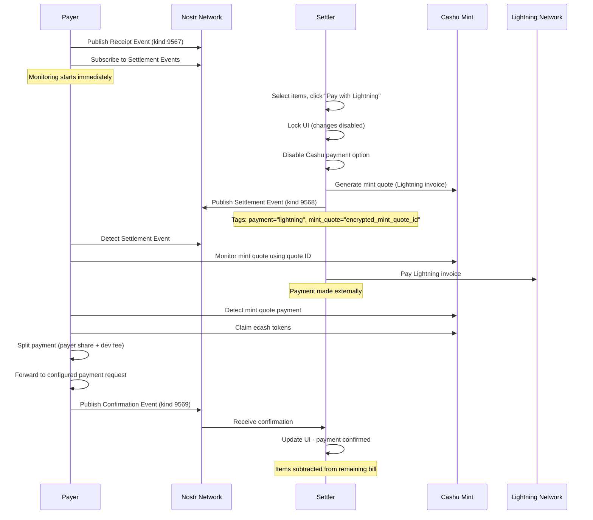
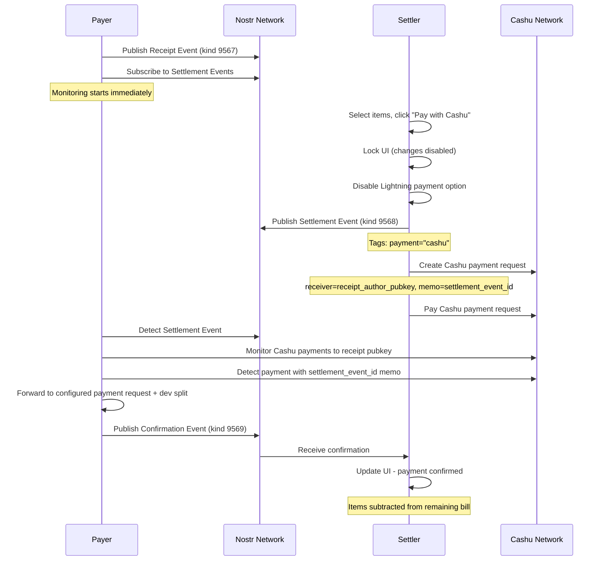

# Reversed Payment Architecture Implementation

## Overview

This document outlines the implementation of a reversed payment architecture for the Receipt.Cash application, addressing the critical issue where settlers pay Lightning invoices but forget to return to their browser, causing payment confirmation failures.

## Core Problem

In the current architecture, settlers handle payment completion on their devices. This creates a "payment and forget" scenario where:
- Settlers pay Lightning invoices externally
- They forget to return to the browser
- Payments never get confirmed to the payer
- The settlement process fails

## Solution: Payment Responsibility Reversal

The payer becomes the payment processor while settlers only initiate payment requests. This ensures reliable payment completion and confirmation.

## Event Structure Specifications

### Settlement Event (kind: 9568)

```javascript
{
  "kind": 9568,
  "pubkey": "settler_pubkey",
  "tags": [
    ["e", "receipt_event_id"],
    ["p", "receipt_author_pubkey"],
    ["payment", "lightning|cashu"],
    ["mint_quote", "encrypted_mint_quote_id"]  // Only for lightning payments, encrypted to receipt publisher's pubkey
  ],
  "content": "encrypted_selected_items_and_details",
  "created_at": timestamp
}
```

### Payment Confirmation Event (kind: 9569)

```javascript
{
  "kind": 9569,
  "pubkey": "payer_pubkey",
  "tags": [
    ["e", "receipt_event_id"],
    ["e", "settlement_event_id"],
    ["p", "settler_pubkey"]
  ],
  "content": "",  // Empty content - just a confirmation signal
  "created_at": timestamp
}
```

## Lightning Payment Flow



## Cashu Payment Flow



## Implementation Components

### 1. Enhanced Settlement Service

```javascript
// src/services/settlement.js
const publishSettlementEvent = async (receiptEventId, settledItems, receiptEncryptionKey, paymentType, receiptAuthorPubkey, mintQuoteId = null) => {
  const tags = [
    ['e', receiptEventId],
    ['p', receiptAuthorPubkey],
    ['payment', paymentType]
  ];
  
  // Add encrypted mint_quote tag only for lightning payments
  if (paymentType === 'lightning' && mintQuoteId) {
    // Encrypt mint quote ID to receipt author's pubkey
    const encryptedMintQuote = await nip44.encrypt(mintQuoteId, receiptAuthorPubkey);
    tags.push(['mint_quote', encryptedMintQuote]);
  }
  
  const event = {
    kind: 9568,
    pubkey: await nostrService.getNostrPublicKey(),
    created_at: Math.floor(Date.now() / 1000),
    content: await nip44.encrypt(JSON.stringify({ settledItems }), encryptionKey),
    tags
  };
  
  // Sign and publish event
  const signedEvent = await ndk.signer.sign(event);
  const ndkEvent = new NDKEvent(ndk, signedEvent);
  await ndkEvent.publish();
  
  return signedEvent.id;
};
```

### 2. Payer Monitoring Service

```javascript
// src/services/payerMonitor.js
class PayerMonitor {
  constructor() {
    this.activeReceipts = new Map();
    this.settlementSubscriptions = new Map();
    this.publishedConfirmations = new Set(); // Track published confirmations
  }
  
  async startMonitoring(receiptEventId, receiptPrivateKey) {
    // Store receipt info
    this.activeReceipts.set(receiptEventId, {
      privateKey: receiptPrivateKey,
      settlements: new Map()
    });
    
    // Subscribe to settlement events immediately
    const subscription = await settlementService.subscribeToSettlements(
      receiptEventId,
      receiptPrivateKey,
      this.handleSettlementEvent.bind(this)
    );
    
    this.settlementSubscriptions.set(receiptEventId, subscription);
  }
  
  async handleSettlementEvent(settlement) {
    const paymentType = settlement.tags.find(tag => tag[0] === 'payment')?.[1];
    
    if (paymentType === 'lightning') {
      await this.processLightningSettlement(settlement);
    } else if (paymentType === 'cashu') {
      await this.processCashuSettlement(settlement);
    }
  }
  
  async processLightningSettlement(settlement) {
    const encryptedMintQuote = settlement.tags.find(tag => tag[0] === 'mint_quote')?.[1];
    
    if (!encryptedMintQuote) {
      console.error('No mint quote found in lightning settlement');
      return;
    }
    
    // Check if we already published a confirmation for this settlement
    if (this.publishedConfirmations.has(settlement.id)) {
      console.log('Already published confirmation for settlement:', settlement.id);
      return;
    }
    
    // Decrypt mint quote ID using our receipt private key
    const receiptEventId = settlement.tags.find(tag => tag[0] === 'e')?.[1];
    const receiptKey = this.activeReceipts.get(receiptEventId)?.privateKey;
    
    if (!receiptKey) {
      console.error('No receipt private key found for decryption');
      return;
    }
    
    let mintQuoteId;
    try {
      mintQuoteId = await nip44.decrypt(encryptedMintQuote, receiptKey);
    } catch (error) {
      console.error('Error decrypting mint quote:', error);
      return;
    }
    
    // Monitor the mint quote for payment
    const checkPayment = async () => {
      try {
        // Stop monitoring if we already published a confirmation
        if (this.publishedConfirmations.has(settlement.id)) {
          console.log('Stopping monitoring - confirmation already published for:', settlement.id);
          return;
        }
        
        const currentStatus = await wallet.checkMintQuote(mintQuoteId);
        
        if (currentStatus.state === MintQuoteState.PAID) {
          await this.claimAndForwardPayment(mintQuoteId, settlement);
        } else {
          // Continue monitoring
          setTimeout(checkPayment, 2000);
        }
      } catch (error) {
        console.error('Error checking mint quote:', error);
        setTimeout(checkPayment, 5000);
      }
    };
    
    checkPayment();
  }
  
  async processCashuSettlement(settlement) {
    const settlementEventId = settlement.id;
    const receiptEventId = settlement.tags.find(tag => tag[0] === 'e')?.[1];
    
    // Check if we already published a confirmation for this settlement
    if (this.publishedConfirmations.has(settlement.id)) {
      console.log('Already published confirmation for settlement:', settlement.id);
      return;
    }
    
    // Monitor Cashu payments to receipt pubkey with settlement memo
    const monitorCashuPayments = async () => {
      // Stop monitoring if we already published a confirmation
      if (this.publishedConfirmations.has(settlement.id)) {
        console.log('Stopping monitoring - confirmation already published for:', settlement.id);
        return;
      }
      
      // Implementation to monitor incoming Cashu payments
      // Check for payments with memo matching settlementEventId
      // When found, forward payment and publish confirmation
      
      // Continue monitoring if no confirmation published
      setTimeout(monitorCashuPayments, 2000);
    };
    
    monitorCashuPayments();
  }
  
  async claimAndForwardPayment(mintQuoteId, settlement) {
    try {
      // Claim ecash from mint quote
      const proofs = await wallet.mintProofs(amount, mintQuoteId);
      
      // Split payment between payer and developer
      const payerAmount = calculatePayerShare(amount, devPercentage);
      const {keep: devProofs, send: payerProofs} = await wallet.send(payerAmount, proofs);
      
      // Forward payments
      await this.forwardPayments(payerProofs, devProofs);
      
      // Publish confirmation event
      await this.publishConfirmation(settlement);
      
    } catch (error) {
      console.error('Error processing payment:', error);
    }
  }
  
  async publishConfirmation(settlement) {
    const receiptEventId = settlement.tags.find(tag => tag[0] === 'e')?.[1];
    const settlerPubkey = settlement.tags.find(tag => tag[0] === 'p')?.[1];
    
    // Mark this settlement as confirmed to prevent duplicate processing
    this.publishedConfirmations.add(settlement.id);
    
    const confirmationEvent = {
      kind: 9569,
      pubkey: await nostrService.getNostrPublicKey(),
      created_at: Math.floor(Date.now() / 1000),
      content: "",
      tags: [
        ['e', receiptEventId],
        ['e', settlement.id],
        ['p', settlerPubkey]
      ]
    };
    
    const signedEvent = await ndk.signer.sign(confirmationEvent);
    const ndkEvent = new NDKEvent(ndk, signedEvent);
    await ndkEvent.publish();
    
    console.log('Published confirmation for settlement:', settlement.id);
  }
}
```

### 3. Receipt Private Key Management

```javascript
// src/utils/receiptKeyManager.js
class ReceiptKeyManager {
  constructor() {
    this.receiptKeys = this.loadPersistedKeys();
  }
  
  generateReceiptKeyPair() {
    const privateKey = generateSecretKey();
    const publicKey = getPublicKey(privateKey);
    return { privateKey, publicKey };
  }
  
  storeReceiptKey(receiptEventId, privateKey) {
    this.receiptKeys.set(receiptEventId, {
      privateKey: Buffer.from(privateKey).toString('hex'),
      timestamp: Date.now()
    });
    
    this.persistKeys();
  }
  
  getReceiptKey(receiptEventId) {
    const keyData = this.receiptKeys.get(receiptEventId);
    return keyData ? Uint8Array.from(Buffer.from(keyData.privateKey, 'hex')) : null;
  }
  
  loadPersistedKeys() {
    try {
      const stored = localStorage.getItem('receipt-cash-receipt-keys');
      if (stored) {
        const data = JSON.parse(stored);
        return new Map(Object.entries(data));
      }
    } catch (error) {
      console.error('Error loading persisted keys:', error);
    }
    return new Map();
  }
  
  persistKeys() {
    try {
      const data = Object.fromEntries(this.receiptKeys);
      localStorage.setItem('receipt-cash-receipt-keys', JSON.stringify(data));
    } catch (error) {
      console.error('Error persisting keys:', error);
    }
  }
  
  cleanupExpiredKeys() {
    const now = Date.now();
    const expiry = 25 * 60 * 60 * 1000; // 25 hours
    
    for (const [eventId, keyData] of this.receiptKeys) {
      if (now - keyData.timestamp > expiry) {
        this.receiptKeys.delete(eventId);
      }
    }
    
    this.persistKeys();
  }
}
```

## Key Architectural Changes

### 1. Payer Responsibilities
- **Immediate Monitoring**: Subscribe to settlement events as soon as receipt is published
- **Payment Processing**: Handle Lightning mint quote monitoring and Cashu payment detection
- **Token Management**: Claim, split, and forward payments
- **Confirmation Publishing**: Publish kind 9569 events when payments are processed

### 2. Settler Responsibilities
- **Payment Initiation**: Generate mint quotes (Lightning) or payment requests (Cashu)
- **UI Locking**: Lock selection and payment method after initiation
- **Settlement Publishing**: Publish kind 9568 events with payment details
- **Confirmation Waiting**: Wait for payer confirmation before updating UI

### 3. New Data Structures

#### Payer Storage
```javascript
{
  "activeReceipts": {
    "receipt_event_id": {
      "privateKey": "hex_private_key",
      "createdAt": timestamp,
      "settlements": {
        "settlement_event_id": {
          "status": "pending|confirmed",
          "amount": 1000,
          "paymentType": "lightning|cashu",
          "settlerPubkey": "pubkey"
        }
      }
    }
  }
}
```

#### Settler Storage
```javascript
{
  "activeSettlements": {
    "settlement_event_id": {
      "receiptEventId": "receipt_event_id",
      "status": "pending|confirmed",
      "paymentType": "lightning|cashu",
      "selectedItems": [...],
      "mintQuoteId": "quote_id", // For lightning
      "paymentRequestId": "req_id" // For cashu
    }
  }
}
```

## Implementation Phases

### Phase 1: Core Event System
1. Update settlement event structure (kind 9568)
2. Implement confirmation event (kind 9569)
3. Create receipt key management system
4. Basic payer monitoring service

### Phase 2: Lightning Integration
1. Mint quote monitoring in payer service
2. Ecash claiming and splitting
3. Payment forwarding with developer fee
4. Confirmation event publishing

### Phase 3: Cashu Integration
1. Cashu payment request generation by settler
2. Payment monitoring by payer
3. Token forwarding and splitting
4. Confirmation event publishing

### Phase 4: UI/UX Updates
1. Payer dashboard for monitoring receipts
2. Settler payment status indicators
3. Real-time settlement updates
4. Error handling and recovery interfaces

## Benefits

1. **Reliability**: No more "payment and forget" scenarios
2. **Simplicity**: Settlers only need to pay, no browser return required
3. **Transparency**: Real-time payment status for all parties
4. **Consistency**: Unified payment processing regardless of method
5. **Scalability**: Centralized monitoring with distributed initiation

## Potential Challenges

1. **Payer Availability**: Payer must be online to process payments
2. **Key Management**: Secure storage of multiple receipt private keys
3. **Error Handling**: Robust recovery mechanisms for failed payments
4. **Performance**: Efficient monitoring of multiple receipts simultaneously
5. **Network Reliability**: Handling Nostr relay failures gracefully

This architecture fundamentally solves the payment completion problem while maintaining the decentralized nature of the system through cryptographic verification and Nostr event publishing.