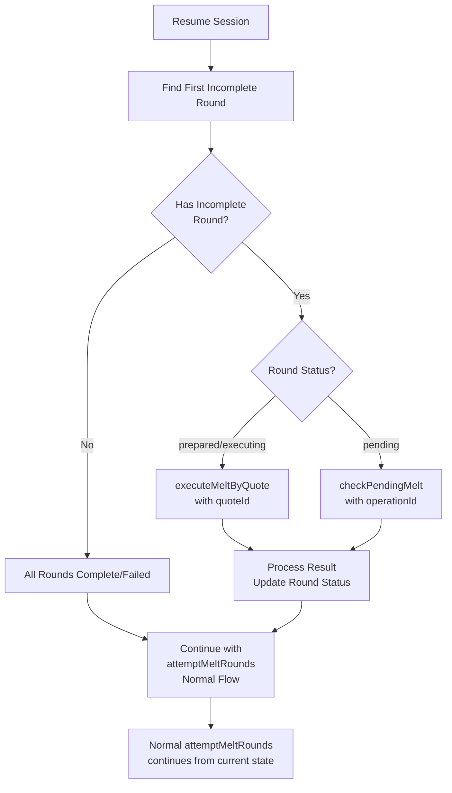

# Lightning Melter Recovery Flow (Simplified)

## Core Principle

**Resume the incomplete round and continue as if nothing happened.**

If we crash during Round 5, we should:
1. Resume Round 5 using Coco's saga API
2. Process the result (success/failure)
3. Continue with Round 6, 7, etc. using the normal flow

## Simple Recovery Flow



## Round States

| Status | Is Complete? | Recovery Action |
|--------|--------------|-----------------|
| `preparing` | ❌ No | Resume from this round |
| `prepared` | ❌ No | Resume with `executeMeltByQuote(quoteId)` |
| `executing` | ❌ No | Resume with `executeMeltByQuote(quoteId)` |
| `pending` | ❌ No | Resume with `checkPendingMelt(operationId)` |
| `finalized` | ✅ Yes | Skip, already done |
| `rolled_back` | ✅ Yes | Skip, already done |
| `failed` | ✅ Yes | Skip, already done |

## Implementation Strategy

### Current (Wrong)
```typescript
// ❌ Complex: Check every round, make decisions, maybe start new rounds
_resumeSession() {
  for each round {
    if (prepared) { resume and maybe complete session }
    if (executing) { resume and maybe complete session }
    if (pending) { check and maybe complete session }
  }
  // Then maybe start new rounds
}
```

### Correct (Simple)
```typescript
// ✅ Simple: Find incomplete round, resume it, continue normal flow
_resumeSession() {
  const incompleteRound = session.rounds.find(r => 
    r.status === 'preparing' || 
    r.status === 'prepared' || 
    r.status === 'executing' || 
    r.status === 'pending'
  );
  
  if (incompleteRound) {
    // Resume this specific round
    await _resumeRound(incompleteRound);
  }
  
  // Continue with normal flow from current state
  await _attemptMeltRounds(session, request);
}
```

## Example: Crash During Round 5

### Before Crash
```
Round 1: rolled_back (didn't fit budget)
Round 2: rolled_back (didn't fit budget)
Round 3: rolled_back (didn't fit budget)
Round 4: rolled_back (didn't fit budget)
Round 5: executing (⏸️ CRASH HERE)
```

### After Resume
```
1. Find incomplete round → Round 5 (executing)
2. Resume Round 5 with executeMeltByQuote(quoteId)
3. Process result:
   - If finalized → Complete session, record accounting, DONE
   - If rolled_back → Mark round, continue to Round 6
   - If failed → Mark round, continue to Round 6
4. Continue normal flow with attemptMeltRounds
   - Tries Round 6, 7, 8... until success or max attempts
```

## Key Simplifications

1. **One incomplete round at a time** - Only the last round can be incomplete
2. **Resume once, continue normally** - Don't try to complete the session early
3. **Let attemptMeltRounds handle the rest** - It already knows how to continue
4. **Session completion happens naturally** - When a round succeeds in normal flow

## The Fix

The problem is `_resumeSession` tries to be too smart:
- It checks every round
- It tries to complete the session immediately
- It makes complex decisions

Instead, it should:
- Find the one incomplete round
- Resume it
- Let the normal flow continue